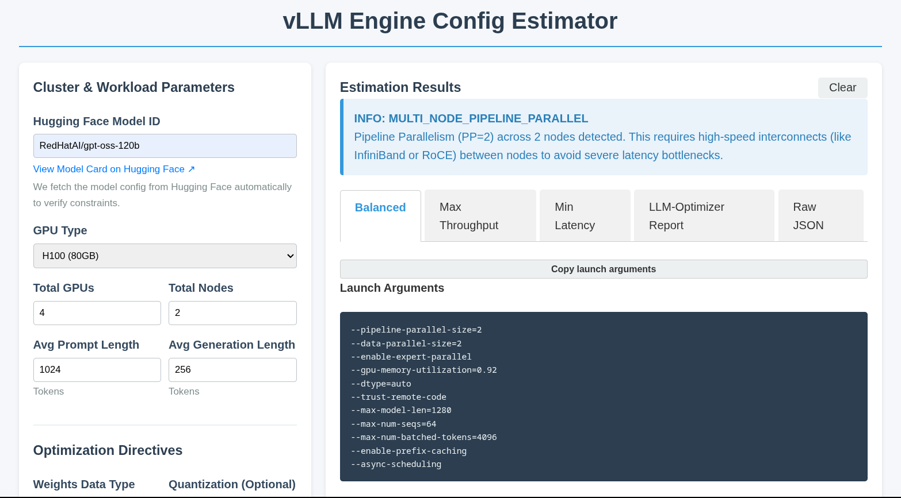
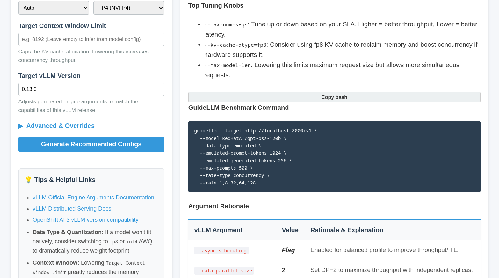
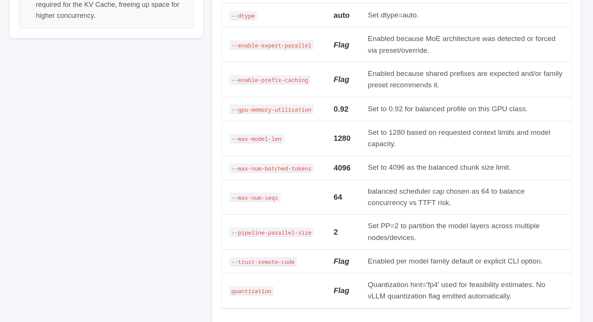

# vLLM Start Config Estimator

A comprehensive, UI-driven tool powered by `llm-optimizer` designed to help users instantly generate, validate, and understand the optimal vLLM engine arguments for deploying Large Language Models.

- **Automates the Math:** Takes the hardware availability, model architecture, and workload shape to calculate VRAM footprint instantly.
- **HuggingFace Integration:** Automatically queries model architectures, expert counts (MoE), and context lengths from HF.
- **Universal Quantization Detection:** Auto-detects precision (FP8, FP4, INT4, INT8, AWQ, GPTQ) intelligently by traversing `config.json`, Hugging Face repo tags, sibling files (like `.gguf`), and `ModelCard` text, gracefully supporting native architectures like Mistral (`params.json`).
- **Profile Generation:** Yields 3 distinct operational profiles tailored for the customer's use case: Balanced, Min Latency, and Max Throughput.
- **vLLM Version Awareness:** Dynamically adjusts suggested CLI arguments based on the target vLLM release, verifying arguments directly against the vLLM GitHub repository to prevent flags that don't exist in older/newer versions.
- **Hardware & Network Aware:** Evaluates multi-node setups and flags network bottlenecks (e.g. warning if InfiniBand/RoCE is required for cross-node PP).
- **Validation:** Provides active Out-of-Memory (OOM) protection by warning if a configuration is not physically feasible before you even touch a cluster.





## Running Locally

To run the web interface locally, you need Python installed on your machine.

1. Clone this repository and navigate to the root directory.
2. Install the core application and web dependencies:
   ```bash
   pip install -e .
   pip install -r requirements.txt
   ```
3. Start the Flask application:
   ```bash
   python3 app.py
   ```
4. Open your web browser and navigate to `http://127.0.0.1:8080`

Run with Podman

1. ```bash
   podman run -d --name vllm-estimator -p 8080:8080 quay.io/jhurlocker/vllm_config_estimator:latest
   ```

2. Open your web browser and navigate to `http://127.0.0.1:8080`

3. ```bash
   podman stop vllm-estimator
   ```

## Deploying to OpenShift

### Option 1: Using the Pre-built Image (Recommended)

You can quickly deploy the application to your OpenShift cluster using the pre-built image from Quay.io.

1. Ensure you are logged into your OpenShift cluster via the `oc` CLI.
2. Create a new project (if needed):
   ```bash
   oc new-project vllm-estimator
   ```
3. Deploy the application using the image:
   ```bash
   oc new-app quay.io/jhurlocker/vllm_config_estimator:latest --name=vllm-config-estimator
   ```
4. Expose the service to create a Route:
   ```bash
   oc expose svc/vllm-config-estimator
   ```
5. Retrieve the Route URL to access your deployed application:
   ```bash
   oc get route vllm-config-estimator
   ```

### Option 2: Building and Deploying from Source

This repository contains a `Containerfile` specifically configured to comply with OpenShift security constraints (running as an arbitrary non-root UID).

1. Build the image locally using Podman:
   ```bash
   podman build -t quay.io/<your-username>/vllm_config_estimator:latest -f Containerfile .
   ```
2. Push the image to a container registry (e.g., Quay.io):
   ```bash
   podman push quay.io/<your-username>/vllm_config_estimator:latest
   ```
3. Ensure you are logged into your OpenShift cluster via the `oc` CLI.
4. Deploy your custom image to OpenShift:
   ```bash
   oc new-project vllm-estimator
   oc new-app quay.io/<your-username>/vllm_config_estimator:latest --name=vllm-config-estimator
   oc expose svc/vllm-config-estimator
   ```
5. Retrieve the Route URL to access your deployed application:
   ```bash
   oc get route vllm-config-estimator
   ```

## Codebase Overview

- `vllm_start_config_from_estimate.py`: The core mathematical and logical engine. This script hooks into Hugging Face to inspect model structures (`config.json`), calculates hardware feasibility, designs 3D Parallelism topologies (TP, PP, DP), and emits the three candidate profiles (latency, throughput, balanced).
- `app.py`: A lightweight Flask server that exposes the Python script's functionality via a REST API (`/estimate`). It handles parsing form data, executing the script safely with timeouts, and returning the structured JSON payload.
- `templates/index.html`: The frontend user interface. It provides a clean, user-friendly form with advanced toggles, dynamically renders the JSON responses into tabulated profiles, and surfaces critical alerts or hardware warnings.
- `vllm_estimate_json_viewer.html`: A standalone, client-side web viewer. It allows users to upload a generated JSON report to visualize metrics, errors, and configuration profiles cleanly outside of the main application.
- `src/`: The core `llm-optimizer` source code which provides theoretical roofline analysis and arithmetic intensity bounds that inform the heuristics.

## Advanced Usage & Overrides

The UI provides an **Advanced & Overrides** section. These map directly to underlying python arguments to let you override heuristics:
- **Optimizer Constraints:** (`--constraints`) Filter outputs against strict SLAs (e.g., `ttft:p95<2s;itl:p95<50ms`).
- **Target vLLM Version:** (`--vllm-version-hint`) Defaults to 0.13.0. The tool reaches out to GitHub to parse the `arg_utils.py` for that specific release and trims out flags that are deprecated or unavailable.
- **Model Family Preset:** (`--model-family`) Force a specific family's caching or architecture behavior instead of relying on auto-detection.
- **Model Parameters (Billions):** (`--model-params-b`) If HuggingFace lookup fails, explicitly provide the parameter count (e.g. `70.5`) to allow VRAM calculation to succeed.
- **Estimation Target:** (`--target`) Manually force `llm-optimizer` to optimize for `throughput` or `latency`.

## AI-Generated Project

This project and its associated tooling (including the web interface, API endpoints, and configuration heuristics) were largely developed through the assistance of an AI coding agent. 

## Community & Contributing

`llm-optimizer` was originally built by BentoML and heavily modified to support this configuration estimation workflow. We welcome contributions of all kinds, such as new features, bug fixes, and documentation.
